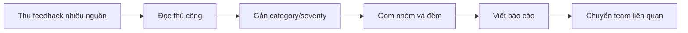
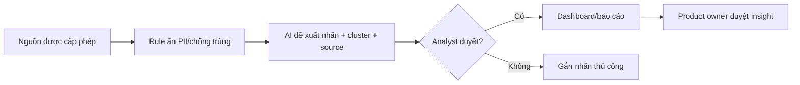
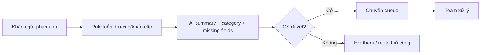
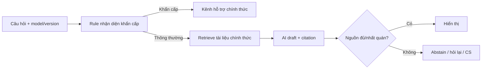

# 01 — Individual Problem Scan

> Chủ đề: **VinFast EV Ecosystem — tìm bài toán phù hợp để ứng dụng AI**. Bản chuẩn bị có hỗ trợ của AI. Số liệu quy mô được dẫn nguồn chính thức; chúng không tự chứng minh pain. Baseline chưa đo được ghi rõ là giả thuyết.

## Thông tin cá nhân

- Họ và tên: Nguyễn Khắc Quang
- Mã học viên: 2A202602885
- Vai trò / bối cảnh: Sinh viên nghiên cứu bài toán AI Product trong hệ sinh thái xe điện VinFast
- Actor: chủ xe VinFast, người dùng EV mới, Customer Service, Product/Customer Experience Team và Service Center

---

## Phase 1 — Scan 10 problems

| # | Lăng kính | Problem quan sát được | Ai chịu ảnh hưởng? | Dấu hiệu thật / trạng thái bằng chứng |
|---|---|---|---|---|
| 1 | AI có thể tốt hơn; pain từ người khác | Phản hồi công khai về xe, ứng dụng và dịch vụ nằm ở nhiều nguồn, khiến Product/Customer Experience Team khó tạo bức tranh vấn đề có cấu trúc và truy vết nguồn | Product Team, Customer Service, Customer Experience | VinFast công bố bàn giao 175.099 ô tô điện tại Việt Nam năm 2025. |
| 2 | Lặp lại; AI có thể tốt hơn | Phản ánh về xe, ứng dụng, sạc, bảo hành hoặc dịch vụ cần được hiểu và chuyển đúng nhóm; ticket mơ hồ có thể phải hỏi bổ sung hoặc chuyển lại | Customer Service, Technical Support, khách hàng | VinFast công khai hotline và hòm thư tiếp nhận phản hồi, nhưng không công khai volume, handling time hoặc transfer rate. Cần interview CS và ticket đã ẩn danh.|
| 3 | Tốn thời gian; AI có thể tốt hơn | Người dùng EV mới có thể mất thời gian tìm câu trả lời đúng phiên bản xe/ngữ cảnh về ứng dụng, sạc, bảo dưỡng và hỗ trợ | Chủ xe VinFast mới | Tài liệu chính thức mô tả ứng dụng có 13 nhóm tính năng cùng nhiều luồng pin/sạc, bản đồ và dịch vụ. Đây chỉ chứng minh **độ rộng thông tin**, chưa chứng minh người dùng tìm khó. |
| 4 | Tốn thời gian; tải nhận thức | Người lái phải cân nhắc vị trí, quãng đường, mức pin và loại điểm sạc khi chọn nơi sạc cho hành trình | Chủ xe VinFast EV | VinFast công bố hơn 150.000 cổng sạc tại 34 tỉnh thành; ứng dụng đã có bản đồ/tìm trạm. Số 120.000 trong bản dán đã được sửa. Chưa có thời gian chọn trạm hoặc tỷ lệ chọn không phù hợp. |
| 5 | AI có thể tốt hơn; pain từ người khác | Phản hồi nghiêm trọng hoặc bất thường có thể bị lẫn trong lượng lớn văn bản nếu việc ưu tiên không nhất quán | Customer Experience, Product, Safety/Service Team | Có thể kiểm chứng bằng bộ dữ liệu severity đã gán nhãn, nhưng **chưa có evidence công khai** về quy trình ưu tiên hay incident bị bỏ sót |
| 6 | Lặp lại | Người dùng mới có thể hỏi lại cùng loại câu hỏi về sạc, ứng dụng và bảo dưỡng khi câu trả lời không gắn với model/software version | Chủ xe mới, Customer Service | VinFast có FAQ, hướng dẫn và manual; chưa có số câu hỏi lặp. Cần đếm topic trong 100 ticket hoặc interview 5 người. |
| 7 | AI có thể tốt hơn; tải nhận thức | Mô tả triệu chứng tự do của khách có thể thiếu bối cảnh để Service Center chuẩn bị bước kiểm tra ban đầu | Cố vấn dịch vụ, kỹ thuật viên, chủ xe | Ứng dụng hỗ trợ cảnh báo lỗi, đặt lịch và theo dõi sửa chữa/hỗ trợ đường bộ. Không có public dataset về triệu chứng, battery health hoặc repair outcome. |
| 8 | Tốn thời gian | Khách tiềm năng phải đối chiếu nhiều phiên bản xe, tính năng, giá và chính sách có thời hạn | Khách hàng tiềm năng, sales advisor | Website có nhiều dòng xe và văn bản chính sách theo thời điểm; đây chưa phải evidence khách mất nhiều thời gian. Cần task test với 5 khách. |
| 9 | Pain từ người khác; tải nhận thức | Người chuyển từ xe xăng sang EV có thể không biết thông tin cần học trước về sạc, pin, phần mềm và bảo dưỡng | Người dùng EV lần đầu | Có hướng dẫn pin/sạc và ứng dụng, nhưng chưa có số liệu riêng về lỗi onboarding. Cần interview người mua trong 90 ngày đầu. |
| 10 | Lặp lại; AI có thể tốt hơn | Khi chính sách/hướng dẫn thay đổi, người dùng hoặc nhân viên có thể truy xuất nhầm tài liệu cũ, sai model hoặc sai thời điểm hiệu lực | Chủ xe, khách tiềm năng, Customer Service | Có nhiều văn bản chính sách/ngày hiệu lực; chưa có số liệu về số lần dùng nhầm. Cần bộ câu hỏi có yếu tố thời gian để kiểm tra truy xuất đúng phiên bản. |

### Phân loại mức độ bằng chứng

**AI đã dùng ở Phase 1:**

- Prompt: tìm problem quanh hệ sinh thái VinFast theo bốn lăng kính; không đưa solution trước; phân biệt fact, inference và assumption.
- Ý dùng: customer voice intelligence, complaint routing, EV knowledge retrieval và policy/version retrieval.
- Ý bỏ/hoãn: predictive maintenance vì không có sensor/service data; claim vận hành nội bộ không có nguồn; số 120.000 điểm sạc cũ vì nguồn mới ghi hơn 150.000 cổng.

**Self-check Phase 1:**

- [x] Có 10 problems và actor cụ thể
- [x] Dùng đủ bốn lăng kính
- [x] Không đặt tên solution thay cho problem trong bảng scan
- [x] Số liệu công khai có nguồn và tách khỏi evidence pain

---

## Phase 2 — Top 3 Problem Cards

### 2.1. Chọn Top 3

| Rank | Problem | Vì sao chọn | Điều còn chưa chắc |
|---|---|---|---|
| 1 | Tổng hợp và phân tích phản hồi khách hàng VinFast | Có thể tạo dataset từ nội dung được phép; workflow rõ; AI phù hợp bước phân loại/tóm tắt | Chưa có volume, manual effort, taxonomy và impact nội bộ |
| 2 | Phân loại và điều hướng phản ánh khách hàng | Bottleneck cụ thể; đo được macro-F1, routing accuracy, handling time và transfer rate | Workflow CS, category, SLA và hậu quả chuyển sai chưa được xác nhận |
| 3 | Truy xuất tri thức EV đúng model/phiên bản | Có tài liệu chính thức; có thể kiểm grounding/citation; privacy thấp hơn ticket nội bộ | Chưa chứng minh search hiện tại gây pain hoặc câu hỏi lặp đủ nhiều |

### 2.2. Problem Cards chi tiết

#### Problem Card #1 — Customer Voice Intelligence

**Problem 1 câu:** Product/Customer Experience Team khó nhanh chóng xác định và truy vết các nhóm vấn đề nổi bật khi phản hồi văn bản về xe, ứng dụng và dịch vụ nằm ở nhiều nguồn với cách diễn đạt khác nhau.

**Actor:** Product Team, Customer Service và Customer Experience Team.

**Bối cảnh:** Khi chuẩn bị báo cáo voice-of-customer hoặc tìm xu hướng issue theo tuần/tháng.

**Current workflow:**

1. Xác định các nguồn phản hồi được phép sử dụng.
2. Xuất hoặc sao chép phản hồi về một nơi.
3. Nhân viên đọc và gắn category/severity.
4. Gom các phản hồi tương tự.
5. Đếm, tóm tắt và chọn ví dụ.
6. Chuyển insight có nguồn cho team liên quan.

**Bottleneck:** Gắn nhãn nhất quán cho văn bản đa dạng và phát hiện topic mới mà taxonomy cũ chưa có.

**Impact:** Chưa có baseline nội bộ. Cần đo feedback/tháng, phút/feedback, inter-annotator agreement, tỷ lệ unclassified và thời gian phát hiện issue.

**Success metric giả thuyết:** Trên holdout set do hai người gán nhãn, macro-F1 category ≥0,85; precision severity cao ≥0,90; giảm ≥50% thời gian labeling; 100% insight/severity cao được người duyệt.

**Non-AI alternative:** Form bắt buộc category, taxonomy cố định, keyword/rule và dashboard thủ công.

**AI hypothesis:** AI đề xuất category, severity, summary, topic cluster và đoạn nguồn; analyst sửa/xác nhận. AI không tự kết luận root cause hay tự gửi cảnh báo.

**Boundary:** Chỉ dùng dữ liệu công khai đúng điều khoản hoặc dữ liệu nội bộ đã cấp quyền/ẩn PII; không dùng sentiment làm căn cứ duy nhất cho severity; luôn giữ source trace.

**Quick gut:** **Workflow + NLP**, không cần Agent.

**Fallback:** Confidence thấp, phát hiện PII, nguồn không được phép hoặc taxonomy không phù hợp → hàng review thủ công.

---

#### Problem Card #2 — Customer Complaint Routing

**Problem 1 câu:** Khách hàng và nhân viên hỗ trợ có thể mất thêm thời gian khi phản ánh tự do thiếu trường cần thiết hoặc được chuyển sai nhóm xử lý.

**Actor:** Customer Service, Technical/Service Team và khách hàng.

**Bối cảnh:** Sau khi khách phản ánh vấn đề về xe, ứng dụng, sạc, bảo hành hoặc dịch vụ.

**Current workflow:** Khách gửi phản ánh → CS đọc → hỏi bổ sung → chọn category/severity → chuyển team → theo dõi/chuyển lại nếu sai.

**Bottleneck:** Hiểu mô tả tự do, phát hiện trường thiếu và ánh xạ vào routing taxonomy.

**Impact:** Chưa có dữ liệu công khai. Cần baseline classification time, first response time, transfer/reopen rate, lượt hỏi bổ sung và SLA breach.

**Success metric giả thuyết:** Routing accuracy ≥90%; giảm ≥30% thời gian phân loại; giảm transfer rate; recall 100% cho class an toàn/khẩn cấp theo rule, với con người duyệt mọi case rủi ro cao.

**Non-AI alternative:** Form có category/required fields, decision tree và queue rule.

**AI hypothesis:** AI tạo summary, đề xuất category/queue và câu hỏi còn thiếu; CS duyệt trước khi chuyển.

**Boundary:** Không chẩn đoán lỗi xe, không tự đóng ticket; case an toàn dùng rule escalation và con người xử lý ngay; không gửi dữ liệu nhạy cảm sang model chưa phê duyệt.

**Quick gut:** **Workflow**, Rule-first cho trường rõ.

**Fallback:** Confidence thấp, category mới, dấu hiệu an toàn hoặc thiếu dữ liệu → dừng auto-routing và chuyển người trực.

---

#### Problem Card #3 — EV Knowledge Retrieval

**Problem 1 câu:** Chủ xe VinFast mới có thể mất thời gian tìm câu trả lời đúng model/phiên bản khi thông tin về ứng dụng, pin/sạc, bảo dưỡng và hỗ trợ nằm trong nhiều trang hướng dẫn, FAQ và manual.

**Actor:** Chủ xe VinFast mới, ưu tiên người dùng trong 90 ngày đầu.

**Bối cảnh:** Khi cần hiểu tính năng, trạng thái sạc, cảnh báo hoặc quy trình dịch vụ không khẩn cấp.

**Current workflow:** Nêu câu hỏi → tìm website/app/manual → mở nhiều kết quả → kiểm model/phiên bản/ngày → tự tổng hợp hoặc liên hệ CS.

**Bottleneck:** Truy xuất đúng đoạn có hiệu lực cho model/phiên bản/ngữ cảnh và phân biệt hướng dẫn chung với cảnh báo an toàn.

**Impact:** Chưa có baseline. Cần usability test 10–20 câu hỏi: time-to-answer, success rate, số trang mở và số lần cần CS.

**Success metric giả thuyết:** Retrieval recall@5 ≥0,90; ≥95% câu trả lời có citation đúng đoạn; 0 câu an toàn thiếu escalation; giảm ≥40% median time-to-answer.

**Non-AI alternative:** FAQ theo model, search có filter model/version và cây điều hướng.

**AI hypothesis:** RAG chỉ dùng corpus chính thức, trả lời có citation/version/date, hỏi lại khi thiếu model và abstain/escalate với câu hỏi an toàn.

**Boundary:** Không chẩn đoán/sửa xe, không thay manual, không trả lời khi nguồn xung đột/hết hiệu lực; không cần dữ liệu hành trình hoặc định danh cho prototype.

**Quick gut:** **RAG Workflow**, không phải chatbot trả lời tự do.

**Fallback:** Search/FAQ có filter, hiển thị nguyên văn nguồn hoặc chuyển CS khi citation không đủ tin cậy.

---

### 2.3. Card muốn pitch nhất

**Card muốn pitch:** Card #1 — Customer Voice Intelligence.

**Pitch 2 phút:**

VinFast công bố đã bàn giao 175.099 ô tô điện tại Việt Nam trong năm 2025, cho thấy phạm vi người dùng lớn, nhưng con số này không tự chứng minh doanh nghiệp gặp pain về feedback. Candidate cần kiểm chứng là: khi phản hồi về xe, ứng dụng và dịch vụ nằm ở nhiều nguồn và được viết theo nhiều cách, Product/Customer Experience Team phải chuẩn hóa chúng trước khi thấy nhóm vấn đề và xu hướng. Bottleneck là gắn category/severity nhất quán và phát hiện topic mới, không phải bước vẽ dashboard. Trước hết cần lấy bộ feedback được phép sử dụng, hai người gán nhãn làm ground truth và đo thời gian, agreement cùng tỷ lệ unclassified. Nếu baseline xác nhận pain, pilot là Rule ẩn PII/chống trùng → AI đề xuất nhãn/cluster có nguồn → analyst duyệt. Target giả thuyết: macro-F1 ≥0,85 và giảm ≥50% thời gian labeling; AI không tự kết luận root cause hay gửi cảnh báo chưa duyệt.

**Câu hỏi muốn nhóm challenge:**

1. Ai thực sự làm workflow này, volume feedback và thời gian labeling hiện tại là bao nhiêu?
2. Form category hoặc keyword rule có giải được 70–80% case không?
3. Review công khai có đại diện cho khách hàng và được phép thu thập/xử lý không?
4. Taxonomy/severity do ai định nghĩa; hai annotator có đồng ý không?
5. Nếu AI gom sai issue an toàn, ai phát hiện và rollback trong bao lâu?

**AI phản biện Card:**

- Điểm yếu: quy mô người dùng không phải evidence cho bottleneck; tên “Customer Voice Intelligence” dễ solution-first; chưa có workflow nội bộ, baseline, taxonomy hay quyền dữ liệu.
- Điều đã sửa: phát biểu problem trước solution; tách fact/inference/assumption; thêm non-AI baseline, data permission, human review, source trace, holdout evaluation và fallback.

### Self-check nộp phần 01

- [x] Có 10 problems + Top 3 Problem Cards đủ field
- [x] Mỗi Card có workflow, bottleneck, metric, boundary và fallback
- [x] Có một card pitch và câu hỏi challenge
- [x] Nguồn công khai được dẫn trực tiếp, không dùng số liệu để giả làm evidence pain
